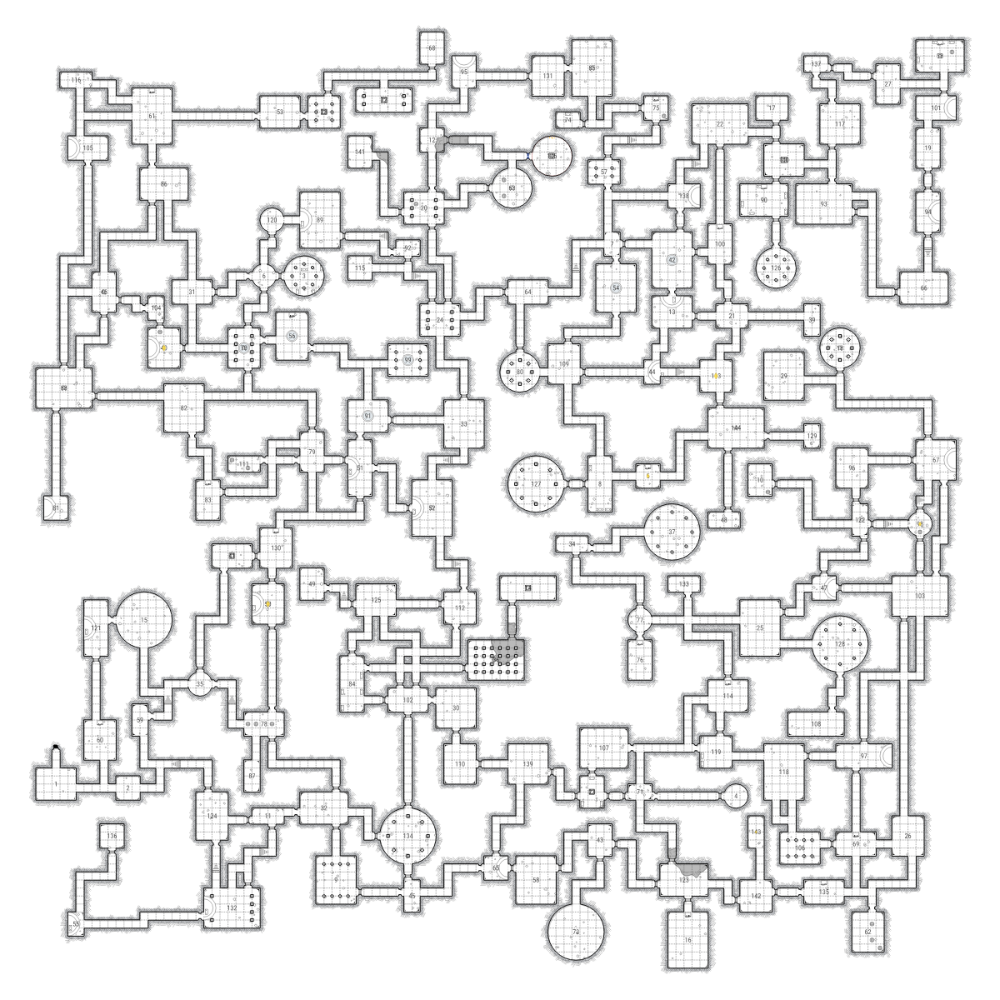

# Dungeongen

A procedural dungeon generation and rendering system for tabletop RPG maps.


## 🎮 Try it Online

*No hosted demo available — run locally instead.*

## Quick Start

```bash
git clone https://github.com/wildfirebill/dungeongen.git
cd dungeongen
pip install -e .
python -m dungeongen.webview.app
```
Then open http://localhost:5050 in your browser to generate dungeons interactively.

## Features

### Layout Generation
- **Procedural room placement** with configurable room sizes and shapes (rectangular, circular)
- **Intelligent passage routing** that connects rooms with hallways
- **Symmetry modes**: None, Bilateral (mirror)
- **Configurable density**: Sparse, Normal, Tight packing
- **Automatic door placement** with open/closed states
- **Stairs and dungeon exits**

### Rendering
- **Hand-drawn aesthetic** with crosshatch shading and organic lines
- **Water features** with procedural shorelines and ripple effects
- **Room decorations**: columns, altars, fountains, dais platforms, rocks, stars, podiums, curtains, barrels, coffins
- **High-quality SVG and PNG output**
- **Grid overlay** for tabletop play

### Water System
Procedural water generation using noise-based field generation:
- **Depth levels**: Dry, Puddles, Pools, Lakes, Flooded
- **Organic shorelines** using marching squares with Chaikin smoothing
- **Ripple effects** that follow contour curves

## Project Structure

```
dungeongen/
├── src/dungeongen/      # Main package
│   ├── layout/          # Dungeon layout generation
│   │   ├── generator.py # Main procedural generator
│   │   ├── numbering.py # Longest-path-first DFS room numbering
│   │   ├── models.py    # Room, Passage, Door data models
│   │   ├── params.py    # Generation parameters
│   │   └── validator.py # Layout validation
│   │
│   ├── map/             # Map rendering system
│   │   ├── map.py       # Main renderer
│   │   ├── room.py      # Room rendering
│   │   ├── passage.py   # Passage rendering
│   │   ├── water_layer.py # Water generation
│   │   └── _props/      # Decorations (columns, altars, etc.)
│   │
│   ├── drawing/         # Drawing utilities
│   │   ├── crosshatch.py    # Crosshatch shading
│   │   └── water.py         # Water rendering
│   │
│   ├── algorithms/      # Generic algorithms
│   │   ├── marching_squares.py  # Contour extraction
│   │   ├── chaikin.py          # Curve smoothing
│   │   └── poisson.py          # Poisson disk sampling
│   │
│   ├── graphics/        # Graphics utilities
│   │   ├── noise.py     # Perlin noise, FBM
│   │   └── shapes.py    # Shape primitives
│   │
│   └── webview/         # Interactive web preview
│       ├── app.py       # Flask application
│       └── templates/   # HTML templates
│
├── tests/               # Test suite
├── docs/                # Documentation
├── debugger/            # Analysis and debugging scripts
└── pyproject.toml       # Package configuration
```

## Installation

### From Source
```bash
git clone https://github.com/wildfirebill/dungeongen.git
cd dungeongen
pip install -e .
```

### Dependencies
- Python 3.10+
- skia-python (rendering)
- numpy (noise generation)
- Flask (web preview)
- rich (logging)

## Usage

### Web Preview
```bash
python -m dungeongen.webview.app
```
Then open http://localhost:5050 in your browser.

### Python API
```python
from dungeongen.layout import DungeonGenerator, GenerationParams, DungeonSize, SymmetryType
from dungeongen.webview.adapter import convert_dungeon
from dungeongen.map.water_layer import WaterDepth

# Configure generation
params = GenerationParams()
params.size = DungeonSize.MEDIUM
params.symmetry = SymmetryType.BILATERAL

# Generate layout
generator = DungeonGenerator(params)
dungeon = generator.generate(seed=42)

# Convert to renderable map with water
dungeon_map = convert_dungeon(dungeon, water_depth=WaterDepth.POOLS)

# Render to PNG or SVG
dungeon_map.render_to_png('my_dungeon.png')
dungeon_map.render_to_svg('my_dungeon.svg')
```

## Configuration Options

### Dungeon Size
- `TINY` - 4-6 rooms
- `SMALL` - 6-10 rooms  
- `MEDIUM` - 10-20 rooms
- `LARGE` - 20-35 rooms
- `XLARGE` - 35-50 rooms
- `XXLARGE` - 50-75 rooms
- `XXXLARGE` - 75-100 rooms
- `MEGA` - 100-125 rooms
- `ULTIMATE` - 125-150 rooms

### Symmetry Types
- `NONE` - Asymmetric layout
- `BILATERAL` - Mirror symmetry (left/right)
- `RADIAL_2` - 180° rotational symmetry
- `RADIAL_4` - 90° rotational symmetry

### Water Depth
- `DRY` - No water
- `PUDDLES` - ~45% coverage
- `POOLS` - ~65% coverage
- `LAKES` - ~82% coverage
- `FLOODED` - ~90% coverage

## Modifications by @wildfirebill

Fixes and upgrades to the original codebase:

- **Expanded dungeon sizes**: Added `XXLARGE` (50-75), `XXXLARGE` (75-100), `ULTIMATE` (125-150) tiers between XLARGE and MEGA
- **Coordinate limit fixes**: Raised hardcoded coordinate limits (4200 → 12800 map units) across the Skia renderer (door, exit, shape group bounds, passage grid size) so MEGA/ULTIMATE dungeons render without crashing
- **Boss rooms & key shards**: Added red glow border for boss rooms, diamond key-shard item icons, locked door padlock overlay, and boss key-requirement labels to the Skia/PNG render pipeline (was layout-SVG-only)
- **Auto-rotate transform**: Map rotation (0-360°) applied around center with auto-recomputed bounds for fitting
- **Room names & dungeon titles**: Deterministic room name generation from tags+seed+number, dungeon title from seed, rendered on the map
- **Webview UI additions**: Rotation control, room names toggle, dungeon title toggle

## Acknowledgments

This project was originally created by [**benjcooley**](https://github.com/benjcooley). Many thanks for the excellent procedural generation and rendering system.

The project was inspired by [**watabou's One Page Dungeon**](https://watabou.itch.io/one-page-dungeon), a fantastic procedural dungeon generator. The hand-drawn crosshatch aesthetic and overall visual style draw heavily from watabou's work.

- **One Page Dungeon Generator**: https://watabou.itch.io/one-page-dungeon
- **watabou's other generators**: https://watabou.itch.io/

### Differences from One Page Dungeon

This is a complete rewrite in Python, not a port. Options do not work identically as this is a completely different codebase. Key differences:

**Not yet implemented:**
- Various bugs and edge cases - not everything works perfectly

## License

MIT License - See [LICENSE](LICENSE) file for details.

---



